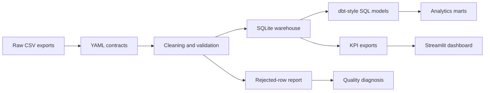

# Case Study: Building A Reliable Retail KPI Pipeline

## Problem

Retail reporting often starts with messy CSV exports from separate customer, product, order, and returns systems. A dashboard can look polished while still being wrong if the data behind it has duplicate orders, missing customers, invalid quantities, or mismatched returns.

I built this project to show the work behind a trusted dashboard: validation, cleaning, loading, modeling, reconciliation, and diagnosis.

## What I Built

- Python CLI pipeline for generating raw demo data, validating contracts, cleaning records, loading SQLite, exporting KPIs, and running checks.
- YAML data contracts for required columns, ID formats, ranges, duplicate keys, and foreign keys.
- Full and incremental load modes with idempotent reruns.
- SQLite warehouse tables for trusted customers, products, orders, returns, and run metadata.
- dbt-style SQL model layer with staging, intermediate, and mart views.
- Streamlit dashboard for executive, sales, product, customer, and data-quality views.
- Quality diagnosis report that explains root cause, severity, and remediation.
- Optional Airflow DAG showing how the workflow could be scheduled.
- Tests, Ruff, Docker, GitHub Actions, and secret scanning.

## Design Decisions

### SQLite First

SQLite keeps the project easy for recruiters to run locally. The warehouse design is portable: the same tables and SQL model layers could move to PostgreSQL or a cloud warehouse later.

### Contracts Before Cleaning

I used YAML contracts before loading because bad data should be visible, not silently dropped. Contract checks catch problems such as duplicate keys, missing foreign keys, and invalid numeric values.

### Dashboard Last

The dashboard is the visible output, but the real project is the reliability layer behind it. The pipeline exports KPI files only after validation, loading, and health checks.

### Diagnosis, Not Just Detection

Most beginner projects stop at "row failed." I added a diagnosis layer that turns issues into likely root causes and remediation actions. That makes the project closer to an operational data product.

## Data Flow

## What Can Break

- Schema drift in raw exports.
- Duplicate primary keys.
- Orders referencing missing customers or products.
- Invalid quantities or financial values.
- Returns referencing missing orders.
- KPI exports disagreeing with warehouse totals.

## Controls

- YAML contracts before load.
- Cleaning rules and rejected-row reports.
- Incremental load deduplication.
- Health checks for required exports and KPI totals.
- Unit tests for pipeline behavior.
- Quality diagnosis and remediation backlog.

## Production Improvements

- Move SQLite to PostgreSQL or a cloud warehouse.
- Convert the SQL layer to real dbt.
- Run the DAG in Airflow or Dagster.
- Add alerting when quality scores drop.
- Add freshness checks and source-level SLA monitoring.
- Add SCD handling for changing customer/product attributes.

## Interview Summary

This is a data engineering project first and a dashboard project second. It proves I can think about data reliability, quality rules, idempotent loading, model structure, dashboard correctness, and operational remediation.
